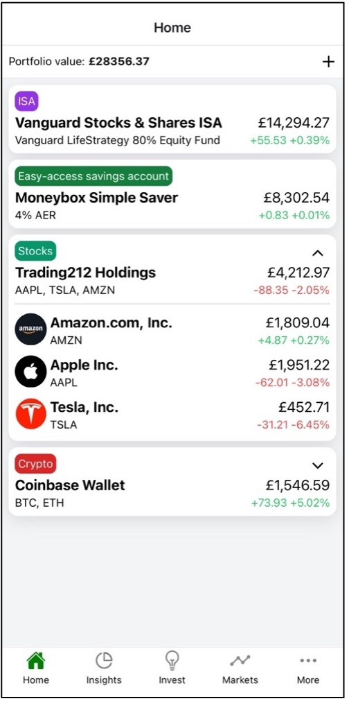
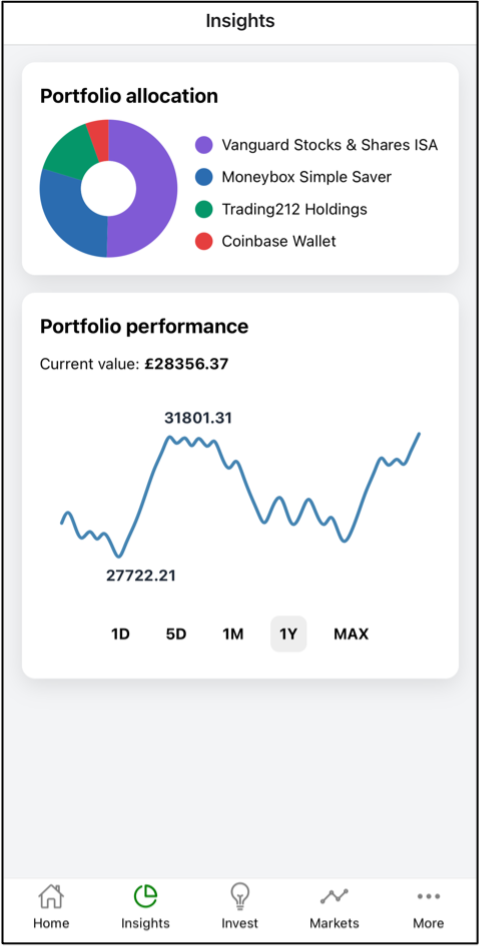
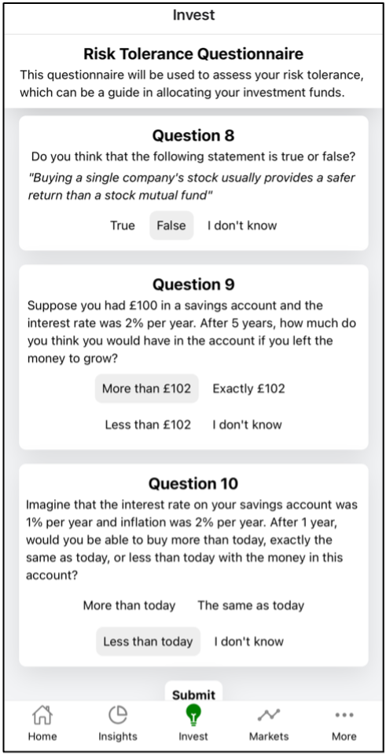
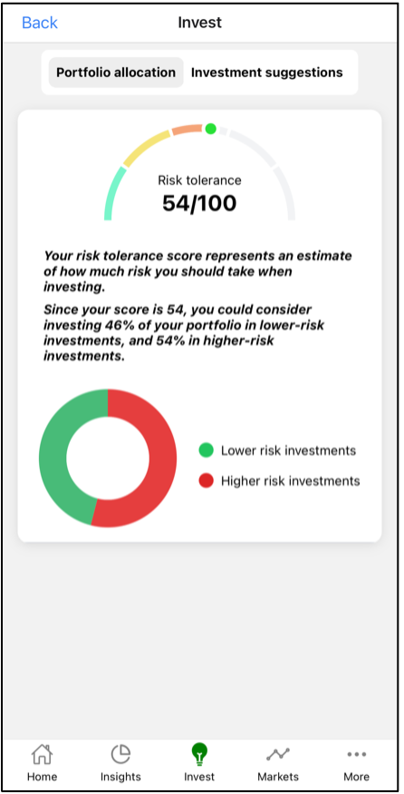
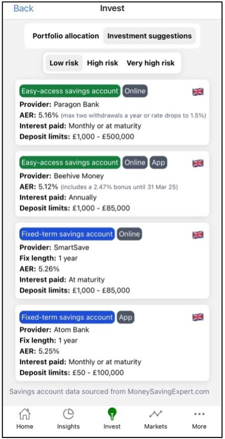
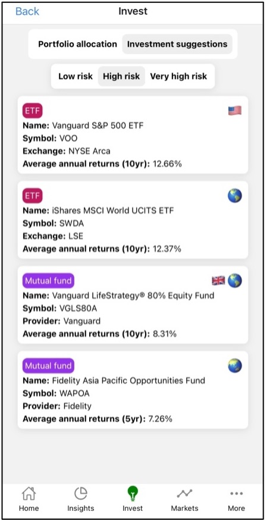
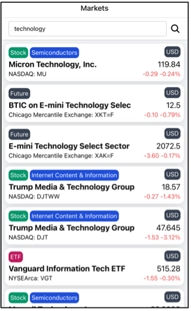
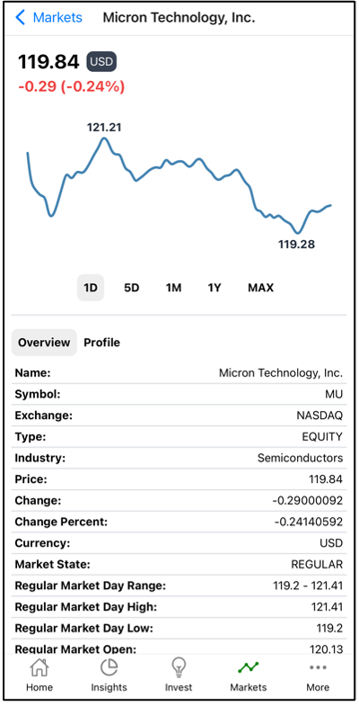

# 📊 AI Portfolio Tracker & Tuner

> A smart, machine learning–powered portfolio allocator with a sleek React Native mobile interface.

## 🧠 Features
- 🧮 Risk-based ML portfolio optimization using historical financial data
- 🧠 Predictive modeling trained on the U.S. 2022 Survey of Consumer Finances (SCF)
- 📱 React Native mobile app for real-time portfolio monitoring and strategy planning
- 📊 Interactive charts for asset allocation, performance, and market trends
- ⚡ Live financial data integration for market-aware insights

## 🚀 App Screenshots

  
  
  

  
  
  

  
  

## 🛠️ Tech Stack

### 🧩 Frontend
- React Native
- Expo
- Tailwind CSS
- Firebase (auth, database)

### 🔬 Backend & ML
- Python, Flask (API server)
- scikit-learn, NumPy, pandas, matplotlib
- Supervised regression model for portfolio optimization and user risk profiling

### 📡 Data Sources
- Yahoo Finance API
- MoneySavingExpert (investment options)

---
